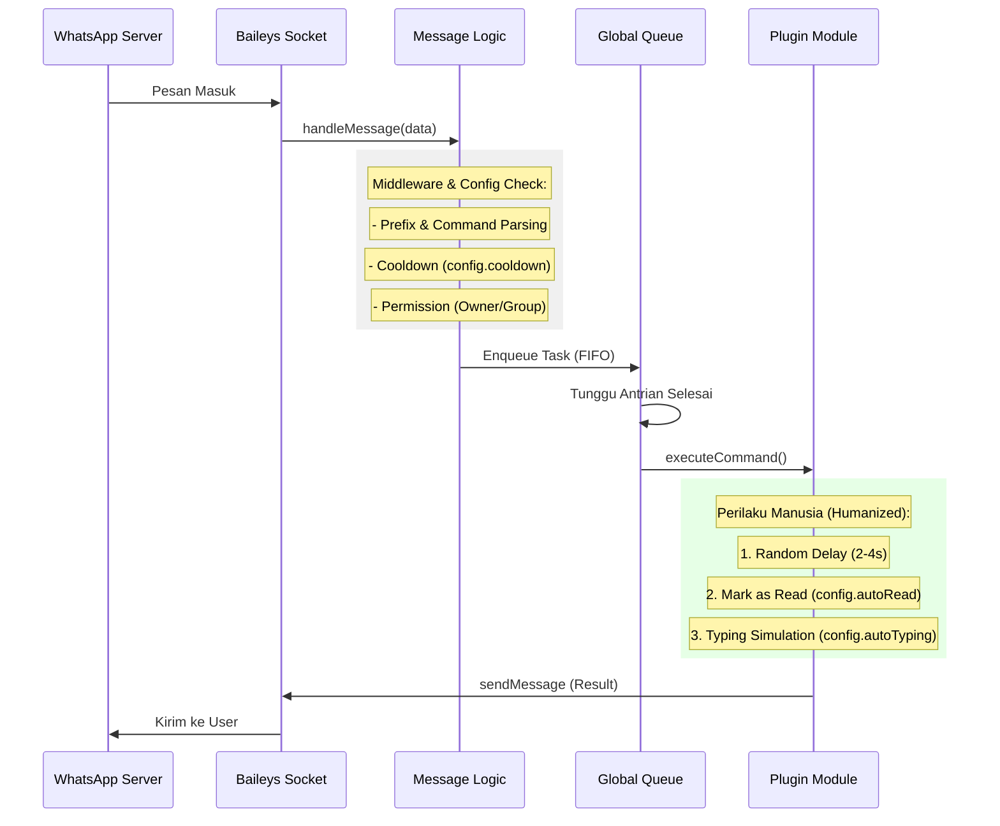

# botwa

WhatsApp Bot modern berbasis **Bun** dan **Baileys** dengan fokus pada keamanan (*anti-ban*), modularitas, dan pengalaman pengembang yang bersih.

---

## 📂 Struktur Proyek & Tanggung Jawab

| Folder / File | Tanggung Jawab |
|:--- |:--- |
| `index.ts` | **Entry Point Utama**. Inisialisasi logger, pembersihan sistem, dan memicu `startBot`. |
| `src/bot.ts` | **Connection Manager**. Mengelola pembuatan socket, autentikasi, dan siklus hidup koneksi (reconnect). |
| `src/core/` | **Machine Logic**. Logika inti mesin bot (Exponential Backoff, Logging sistem). |
| `src/handlers/` | **Event Responders**. Menangani event dari WhatsApp (Pesan masuk, Panggilan masuk). |
| `src/library/` | **Shared Libraries**. Kumpulan utilitas (Global Queue, Session Manager, Database, GC). |
| `src/systems/` | **Bot Engine**. Sistem internal untuk Plugin Loader, Hot-Reload, dan Plugin Registry. |
| `src/plugins/` | **Command Plugins**. Tempat menyimpan logika perintah bot (Menu, Ping, dll). |
| `src/types/` | **Type Definitions**. Definisi tipe data TypeScript global dan lokal. |
| `src/config/` | **Configuration**. Pengaturan bot (Nomor owner, prefix, fitur toggle). |
| `auth_session/` | **Session Data**. Menyimpan kredensial login WhatsApp (Jangan di-commit). |
| `database/` | **Persistent Storage**. Penyimpanan data statistik dan preferensi user (JSON). |
| `logs/` | **System Logs**. Log harian yang diarsipkan secara otomatis. |

---

## ⚙️ Fitur Backend (Core Systems)

Bot ini tidak hanya sekadar membalas pesan, tapi memiliki infrastruktur backend yang canggih:

- **Humanized Behavior**: Simulasi perilaku manusia dengan jeda baca (*hyper-aggressive auto-read*) yang menjamin sinkronisasi notifikasi di semua perangkat, serta durasi mengetik (*typing*) yang diacak secara cerdas.
- **Smart Presence Management**: Bot menjadi online secara cerdas hanya saat ada interaksi, dengan sistem *concurrency protection* untuk mencegah spam log.
- **Global FIFO Command Queue**: Menjamin bot hanya mengeksekusi satu perintah dalam satu waktu secara berurutan. Ini mencegah aktivitas paralel yang mencurigakan di mata WhatsApp.
- **Smart Anti-Call System**: Menolak panggilan secara otomatis dengan sistem peringatan bertahap hingga blokir otomatis jika user melanggar batas.
- **Automated Garbage Collector**: Pembersihan rutin setiap jam untuk menghapus file sampah di folder `tmp`, mengarsipkan log lama, dan membersihkan sesi expired.
- **Decorator-based Plugin System**: Menggunakan standar industri modern (`@Command`) untuk pendaftaran plugin yang bersih dan deklaratif.
- **Global Variable Injection**: Mengurangi *boilerplate* kode dengan menyediakan variabel penting (`sock`, `config`, `logger`, dll) secara global di seluruh plugin.
- **LID-to-PN Resolver Native**: Solusi bawaan untuk mengubah ID WhatsApp terbaru (`@lid`) menjadi nomor telepon biasa tanpa merusak `node_modules`.
- **Biome.js Integration**: Standar global untuk *linting* dan *formatting* kode yang super cepat.
- **Husky Pre-commit Hook**: Menjamin kualitas kode dengan menjalankan pengecekan otomatis sebelum pengembang melakukan `git commit`.

---

## 🚀 Memulai

### Prasyarat
- [Bun](https://bun.sh/) installed.

### Instalasi
```bash
# Install dependensi
bun install

# Inisialisasi Husky (Opsional)
bun run prepare
```

### Menjalankan Bot
```bash
# Format kode sesuai standar Biome
bun run format

# Jalankan bot
bun run start
```

---

## 🔄 Alur Kerja Sistem (System Workflow)

Diagram di bawah ini menjelaskan siklus hidup bot dari saat dijalankan hingga eksekusi perintah dengan perilaku manusia (*humanized*):



---

## ⚙️ Penggunaan Konfigurasi (Config Usage)

Sistem menggunakan file `src/config/config.ts` sebagai pusat kendali perilaku bot. Beberapa fitur utama yang dikontrol melalui config:

- **Anti-Spam**: `cooldown` (default 3000ms) untuk membatasi frekuensi perintah per user.
- **Privacy & Stealth**: `autoRead` untuk centang biru otomatis dan `autoTyping` untuk simulasi mengetik yang diacak durasinya.
- **Security**: `ownerNumber` untuk hak akses penuh dan `antiCall` untuk memblokir panggilan masuk secara otomatis.
- **Connectivity**: `usePairingCode` dan `customPairingCode` untuk login tanpa scan QR.

---

## 🧩 Sistem Plugin (Plugin System)

Bot mendukung dua metode pendaftaran plugin yang fleksibel:

1. **Decorator-based (Modern)**: Menggunakan class dengan decorator `@Command`.
   ```typescript
   @Command({ name: "ping", category: "general" })
   export default class PingCommand implements BaseCommand {
     async execute(sock: WASocket, m: MessageData) {
       await sock.sendMessage(m.from, { text: "Pong!" });
     }
   }
   ```
2. **Object-based (Classic)**: Export langsung objek `command`.
   ```typescript
   export const command: PluginCommand = {
     name: "ping",
     execute: async (sock, m) => { ... }
   };
   ```

Setiap plugin yang diletakkan di `src/plugins/` akan dimuat secara otomatis saat startup dan mendukung fitur **Hot-Reload** (perubahan kode langsung diterapkan tanpa restart bot).

---

## 🛠️ Siklus Pengembangan & Sistem Git

Proyek ini menggunakan standar industri untuk menjaga kualitas kode:

1.  **Version Control**: Menggunakan Git untuk pelacakan perubahan.
2.  **Code Quality (Biome)**: Menggunakan Biome.js untuk linting dan formatting. Lebih cepat dari ESLint/Prettier.
3.  **Husky Pre-commit Hook**: Setiap kali Anda menjalankan `git commit`, Husky akan otomatis menjalankan `bun run lint`. Jika ada error formatting atau linting, commit akan ditolak hingga kode diperbaiki.
4.  **Modular Plugins**: Menambah fitur baru cukup dengan membuat file baru di `src/plugins/` menggunakan decorator `@Command`.

---

## 🛠️ Maintenance
Untuk panduan mendalam tentang cara mengembangkan plugin dan memelihara kode, silakan baca **[HOW_TO_MAINTENANCE.md](./HOW_TO_MAINTENANCE.md)**.
